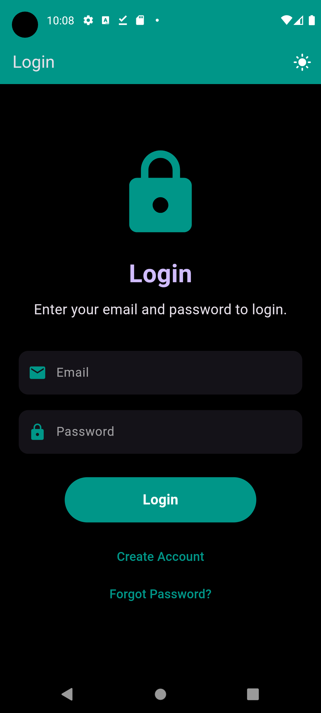
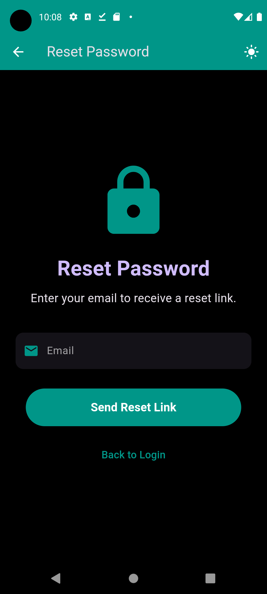
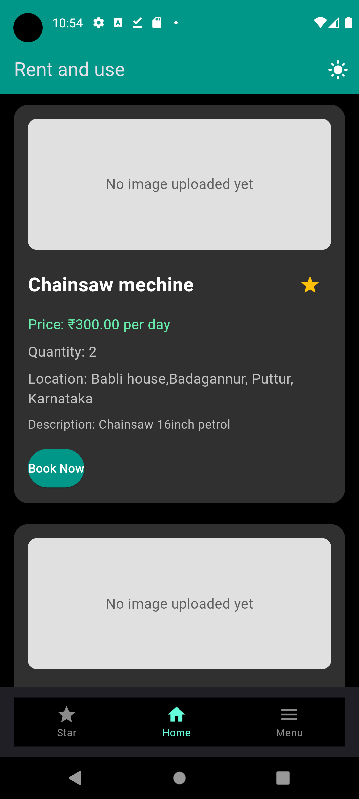
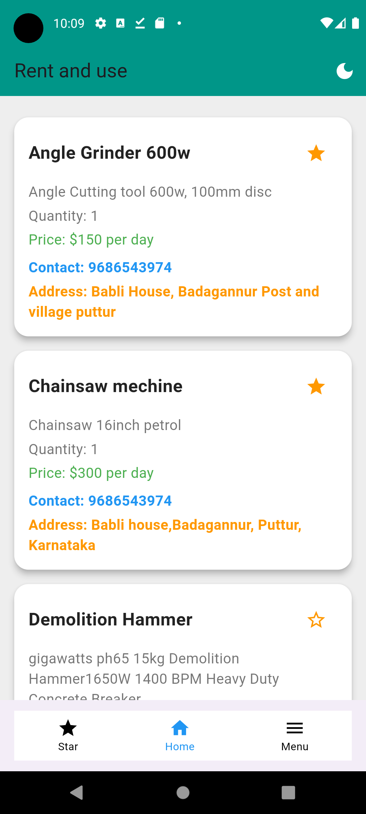
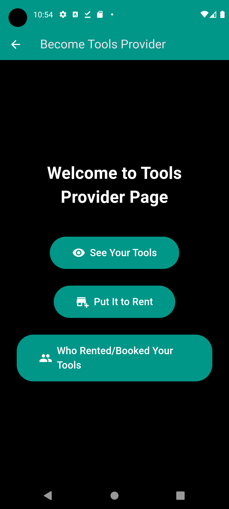
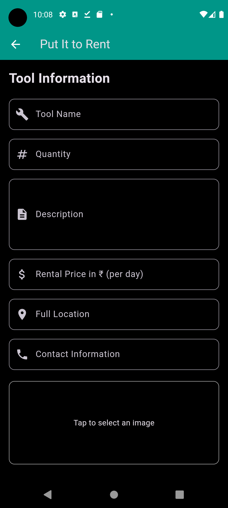
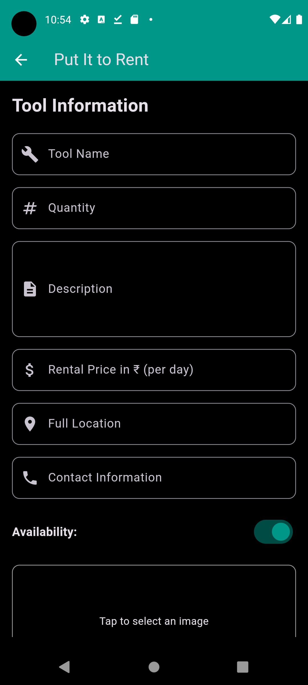
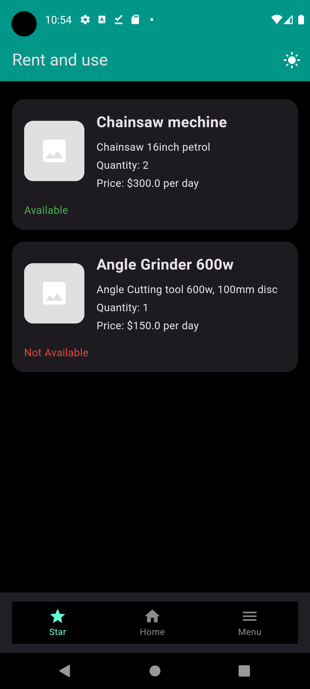
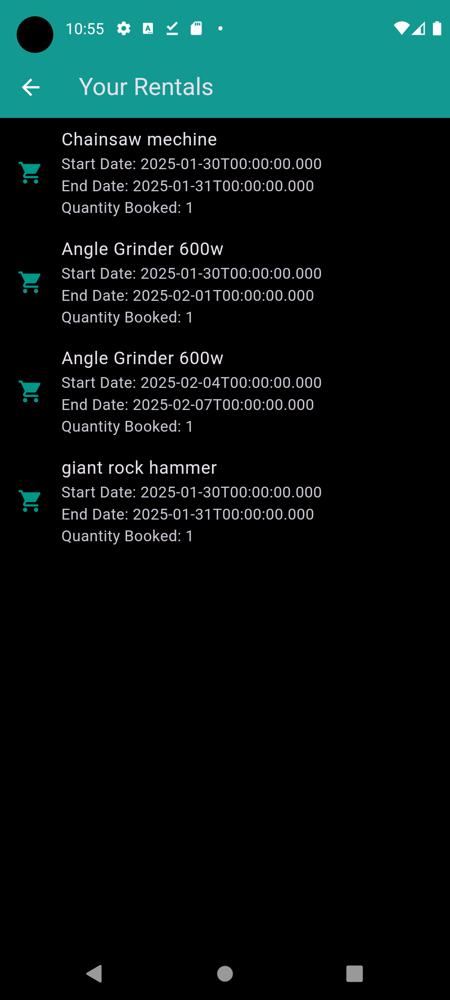
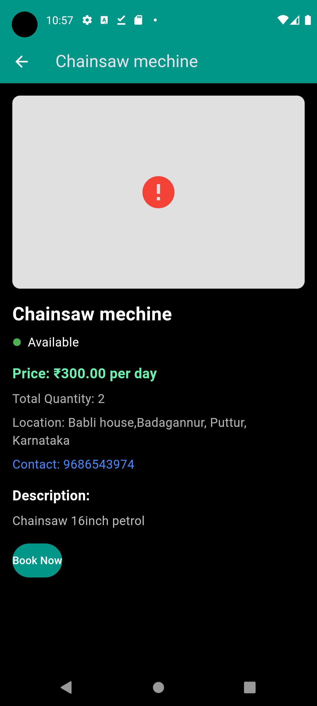

# Rent-N-Use - A Flutter Project
Rent-N-Use is a Flutter-based platform designed to simplify the process of renting out tools or borrowing tools on rent. It connects tool owners with renters in a seamless and secure manner, making it easier than ever to share resources.

## Project Overview
This project is currently in its early stages but already demonstrates core functionality. Built using Flutter , the app provides a responsive and intuitive user interface. The backend leverages Firestore for real-time data storage and Firebase Authentication for secure user login and management.

While the primary focus is on Android, there are plans to expand support to iOS in the near future. The goal is to create a cross-platform solution that works seamlessly across devices.

## Key Features
1. Tool Rental
Rent out your tools or borrow tools from others effortlessly.
View detailed information about each tool, including availability, price, location, and contact details.
2. Secure Authentication
Firebase Authentication ensures secure and easy login for users.
Users can sign up, log in, and manage their accounts securely.
3. Real-Time Data with Firestore
Tools and user data are stored in Firestore , enabling real-time updates and synchronization.
Owners can update tool availability, and renters can view changes instantly.
4. User-Friendly Interface
Clean and intuitive UI/UX design ensures a smooth experience for both tool owners and renters.
Dark mode support for better accessibility.
5. Starred Tools
Users can "star" their favorite tools for quick access later.
6. Booking System
Renters can book tools directly through the app, selecting start and end dates and confirming availability.

## Screenshots
Below are some screenshots showcasing the progress of the project:

  
*Figure 1: Login Screen* 
  
*Figure 2: Reset Password Screen*
  
*Figure 3: Home Screen* 
  
*Figure 4: Menu*
  
*Figure 5: Tools Provider Screen* 
  
*Figure 6: see your tools Screen*
  
*Figure 7: Put to rent Screen* 
  
*Figure 8: starred tools Screen*
  
*Figure 9: rent Screen* 
 
*Figure 10: see full details Screen*

## Technologies Used
Flutter : For building the cross-platform mobile app.
Firebase :
Firestore : Real-time database for storing tool and user data.
Authentication : Secure user login and account management.
Dart : Programming language used for Flutter development.
Acknowledgments
Thank you for checking out Rent-N-Use ! This project is still growing, and your feedback and contributions are invaluable. If you have any questions, suggestions, or ideas, feel free to reach out.

## Contact
Developer : Anwesh Krishna B
GitHub Profile : https://github.com/Anwesh003
Email : anweshkrishnab6324@gmail.com
Thank You!
We hope you enjoy exploring Rent-N-Use and find it useful. Your support and contributions will help us make this project even better!