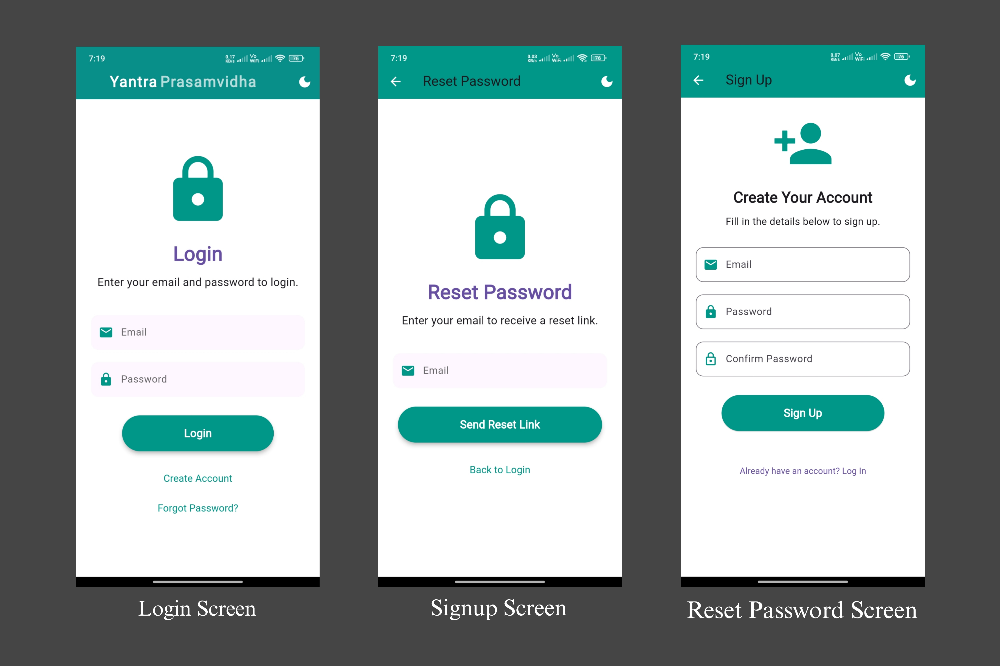
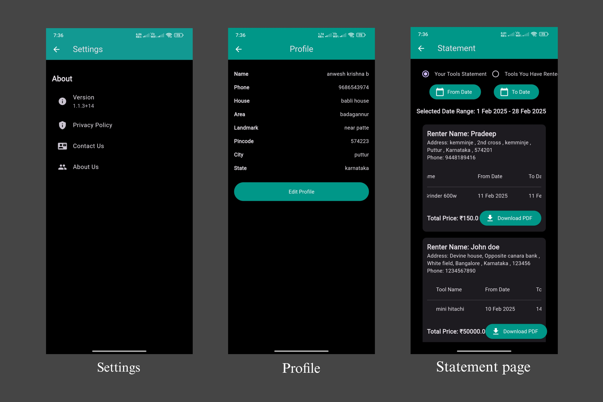

<div align="left" style="position: relative;">

<h1>RENT-N-USE-TOOLS</h1>

</p>


</div>
<br clear="right">

##  Table of Contents

- [ Overview](#-overview)
- [ Features](#-features)
- [ Project Structure](#-project-structure)
  - [ Project Index](#-project-index)
- [ Getting Started](#-getting-started)
  - [ Prerequisites](#-prerequisites)
  - [ Installation](#-installation)
  - [ Usage](#-usage)
  - [ Testing](#-testing)
- [ Project Roadmap](#-project-roadmap)
- [ Contributing](#-contributing)
- [ License](#-license)
- [ Acknowledgments](#-acknowledgments)

---

##  Overview

<code>❯
This project is currently in its early stages but already demonstrates core functionality. Built using Flutter , the app provides a responsive and intuitive user interface. The backend leverages Firestore for real-time data storage and Firebase Authentication for secure user login and management.

While the primary focus is on Android, there are plans to expand support to iOS in the near future. The goal is to create a cross-platform solution that works seamlessly across devices.

</code>

---

##  Features

<code>❯
1. Tool Rental
Rent out your tools or borrow tools from others effortlessly.
View detailed information about each tool, including availability, price, location, and contact details.
2. Secure Authentication
Firebase Authentication ensures secure and easy login for users.
Users can sign up, log in, and manage their accounts securely.
3. Real-Time Data with Firestore
Tools and user data are stored in Firestore , enabling real-time updates and synchronization.
Owners can update tool availability, and renters can view changes instantly.
4. User-Friendly Interface
Clean and intuitive UI/UX design ensures a smooth experience for both tool owners and renters.
Dark mode support for better accessibility.
5. Starred Tools
Users can "star" their favorite tools for quick access later.
6. Booking System
Renters can book tools directly through the app, selecting start and end dates and confirming availability.
Below are some screenshots showcasing the progress of the project:

  

  

  

  

  

  

  


</code>

---

##  Project Structure

```sh
└── rent-n-use-tools/
    ├── README.md
    ├── analysis_options.yaml
    ├── android
    │   ├── .gitignore
    │   ├── app
    │   ├── build.gradle
    │   ├── gradle
    │   ├── gradle.properties
    │   └── settings.gradle
    ├── assets
    │   ├── aneesh.jpg
    │   ├── anwesh.jpg
    │   ├── avatar.jpg
    │   ├── awatar1.jpg
    │   ├── chinmay.jpg
    │   ├── fonts
    │   ├── ganesh.jpg
    │   ├── pradeepsir.jpg
    │   ├── splash_logo.jpg
    │   ├── vcetlogo.png
    │   ├── yantra.jpg
    │   └── yantraprasamvidha.png
    ├── firebase.json
    ├── ios
    │   ├── .gitignore
    │   ├── Flutter
    │   ├── Runner
    │   ├── Runner.xcodeproj
    │   ├── Runner.xcworkspace
    │   └── RunnerTests
    ├── lib
    │   ├── Logins
    │   ├── MainScreen
    │   ├── Menu
    │   ├── auth_service.dart
    │   ├── firebase_options.dart
    │   ├── main.dart
    │   ├── theme_provider.dart
    │   └── toolsprovider
    ├── linux
    │   ├── .gitignore
    │   ├── CMakeLists.txt
    │   ├── flutter
    │   ├── main.cc
    │   ├── my_application.cc
    │   └── my_application.h
    ├── macos
    │   ├── .gitignore
    │   ├── Flutter
    │   ├── Runner
    │   ├── Runner.xcodeproj
    │   ├── Runner.xcworkspace
    │   └── RunnerTests
    ├── pubspec.lock
    ├── pubspec.yaml
    ├── screenshots
    │   ├── screenshot1.jpg
    │   ├── screenshot2.jpg
    │   ├── screenshot3.jpg
    │   ├── screenshot4.jpg
    │   ├── screenshot5.jpg
    │   ├── screenshot6.jpg
    │   └── screenshot7.jpg
    ├── test
    │   └── widget_test.dart
    ├── true
    ├── web
    │   ├── favicon.png
    │   ├── icons
    │   ├── index.html
    │   ├── manifest.json
    │   └── splash
    └── windows
        ├── .gitignore
        ├── CMakeLists.txt
        ├── flutter
        └── runner
```


###  Project Index
<details open>
	<summary><b><code>RENT-N-USE-TOOLS/</code></b></summary>
	<details> <!-- __root__ Submodule -->
		<summary><b>__root__</b></summary>
		<blockquote>
			<table>
			<tr>
				<td><b><a href='https://github.com/Anwesh003/rent-n-use-tools/blob/master/firebase.json'>firebase.json</a></b></td>
				<td><code>❯ REPLACE-ME</code></td>
			</tr>
			<tr>
				<td><b><a href='https://github.com/Anwesh003/rent-n-use-tools/blob/master/analysis_options.yaml'>analysis_options.yaml</a></b></td>
				<td><code>❯ REPLACE-ME</code></td>
			</tr>
			<tr>
				<td><b><a href='https://github.com/Anwesh003/rent-n-use-tools/blob/master/true'>true</a></b></td>
				<td><code>❯ REPLACE-ME</code></td>
			</tr>
			<tr>
				<td><b><a href='https://github.com/Anwesh003/rent-n-use-tools/blob/master/pubspec.yaml'>pubspec.yaml</a></b></td>
				<td><code>❯ REPLACE-ME</code></td>
			</tr>
			</table>
		</blockquote>
	</details>
	<details> <!-- ios Submodule -->
		<summary><b>ios</b></summary>
		<blockquote>
			<details>
				<summary><b>Runner.xcworkspace</b></summary>
				<blockquote>
					<table>
					<tr>
						<td><b><a href='https://github.com/Anwesh003/rent-n-use-tools/blob/master/ios/Runner.xcworkspace/contents.xcworkspacedata'>contents.xcworkspacedata</a></b></td>
						<td><code>❯ REPLACE-ME</code></td>
					</tr>
					</table>
					<details>
						<summary><b>xcshareddata</b></summary>
						<blockquote>
							<table>
							<tr>
								<td><b><a href='https://github.com/Anwesh003/rent-n-use-tools/blob/master/ios/Runner.xcworkspace/xcshareddata/WorkspaceSettings.xcsettings'>WorkspaceSettings.xcsettings</a></b></td>
								<td><code>❯ REPLACE-ME</code></td>
							</tr>
							<tr>
								<td><b><a href='https://github.com/Anwesh003/rent-n-use-tools/blob/master/ios/Runner.xcworkspace/xcshareddata/IDEWorkspaceChecks.plist'>IDEWorkspaceChecks.plist</a></b></td>
								<td><code>❯ REPLACE-ME</code></td>
							</tr>
							</table>
						</blockquote>
					</details>
				</blockquote>
			</details>
			<details>
				<summary><b>Runner.xcodeproj</b></summary>
				<blockquote>
					<table>
					<tr>
						<td><b><a href='https://github.com/Anwesh003/rent-n-use-tools/blob/master/ios/Runner.xcodeproj/project.pbxproj'>project.pbxproj</a></b></td>
						<td><code>❯ REPLACE-ME</code></td>
					</tr>
					</table>
					<details>
						<summary><b>xcshareddata</b></summary>
						<blockquote>
							<details>
								<summary><b>xcschemes</b></summary>
								<blockquote>
									<table>
									<tr>
										<td><b><a href='https://github.com/Anwesh003/rent-n-use-tools/blob/master/ios/Runner.xcodeproj/xcshareddata/xcschemes/Runner.xcscheme'>Runner.xcscheme</a></b></td>
										<td><code>❯ REPLACE-ME</code></td>
									</tr>
									</table>
								</blockquote>
							</details>
						</blockquote>
					</details>
					<details>
						<summary><b>project.xcworkspace</b></summary>
						<blockquote>
							<table>
							<tr>
								<td><b><a href='https://github.com/Anwesh003/rent-n-use-tools/blob/master/ios/Runner.xcodeproj/project.xcworkspace/contents.xcworkspacedata'>contents.xcworkspacedata</a></b></td>
								<td><code>❯ REPLACE-ME</code></td>
							</tr>
							</table>
							<details>
								<summary><b>xcshareddata</b></summary>
								<blockquote>
									<table>
									<tr>
										<td><b><a href='https://github.com/Anwesh003/rent-n-use-tools/blob/master/ios/Runner.xcodeproj/project.xcworkspace/xcshareddata/WorkspaceSettings.xcsettings'>WorkspaceSettings.xcsettings</a></b></td>
										<td><code>❯ REPLACE-ME</code></td>
									</tr>
									<tr>
										<td><b><a href='https://github.com/Anwesh003/rent-n-use-tools/blob/master/ios/Runner.xcodeproj/project.xcworkspace/xcshareddata/IDEWorkspaceChecks.plist'>IDEWorkspaceChecks.plist</a></b></td>
										<td><code>❯ REPLACE-ME</code></td>
									</tr>
									</table>
								</blockquote>
							</details>
						</blockquote>
					</details>
				</blockquote>
			</details>
			<details>
				<summary><b>Flutter</b></summary>
				<blockquote>
					<table>
					<tr>
						<td><b><a href='https://github.com/Anwesh003/rent-n-use-tools/blob/master/ios/Flutter/AppFrameworkInfo.plist'>AppFrameworkInfo.plist</a></b></td>
						<td><code>❯ REPLACE-ME</code></td>
					</tr>
					<tr>
						<td><b><a href='https://github.com/Anwesh003/rent-n-use-tools/blob/master/ios/Flutter/Debug.xcconfig'>Debug.xcconfig</a></b></td>
						<td><code>❯ REPLACE-ME</code></td>
					</tr>
					<tr>
						<td><b><a href='https://github.com/Anwesh003/rent-n-use-tools/blob/master/ios/Flutter/Release.xcconfig'>Release.xcconfig</a></b></td>
						<td><code>❯ REPLACE-ME</code></td>
					</tr>
					</table>
				</blockquote>
			</details>
			<details>
				<summary><b>RunnerTests</b></summary>
				<blockquote>
					<table>
					<tr>
						<td><b><a href='https://github.com/Anwesh003/rent-n-use-tools/blob/master/ios/RunnerTests/RunnerTests.swift'>RunnerTests.swift</a></b></td>
						<td><code>❯ REPLACE-ME</code></td>
					</tr>
					</table>
				</blockquote>
			</details>
			<details>
				<summary><b>Runner</b></summary>
				<blockquote>
					<table>
					<tr>
						<td><b><a href='https://github.com/Anwesh003/rent-n-use-tools/blob/master/ios/Runner/Runner-Bridging-Header.h'>Runner-Bridging-Header.h</a></b></td>
						<td><code>❯ REPLACE-ME</code></td>
					</tr>
					<tr>
						<td><b><a href='https://github.com/Anwesh003/rent-n-use-tools/blob/master/ios/Runner/AppDelegate.swift'>AppDelegate.swift</a></b></td>
						<td><code>❯ REPLACE-ME</code></td>
					</tr>
					<tr>
						<td><b><a href='https://github.com/Anwesh003/rent-n-use-tools/blob/master/ios/Runner/Info.plist'>Info.plist</a></b></td>
						<td><code>❯ REPLACE-ME</code></td>
					</tr>
					</table>
					<details>
						<summary><b>Assets.xcassets</b></summary>
						<blockquote>
							<details>
								<summary><b>LaunchImage.imageset</b></summary>
								<blockquote>
									<table>
									<tr>
										<td><b><a href='https://github.com/Anwesh003/rent-n-use-tools/blob/master/ios/Runner/Assets.xcassets/LaunchImage.imageset/Contents.json'>Contents.json</a></b></td>
										<td><code>❯ REPLACE-ME</code></td>
									</tr>
									</table>
								</blockquote>
							</details>
							<details>
								<summary><b>LaunchBackground.imageset</b></summary>
								<blockquote>
									<table>
									<tr>
										<td><b><a href='https://github.com/Anwesh003/rent-n-use-tools/blob/master/ios/Runner/Assets.xcassets/LaunchBackground.imageset/Contents.json'>Contents.json</a></b></td>
										<td><code>❯ REPLACE-ME</code></td>
									</tr>
									</table>
								</blockquote>
							</details>
							<details>
								<summary><b>AppIcon.appiconset</b></summary>
								<blockquote>
									<table>
									<tr>
										<td><b><a href='https://github.com/Anwesh003/rent-n-use-tools/blob/master/ios/Runner/Assets.xcassets/AppIcon.appiconset/Contents.json'>Contents.json</a></b></td>
										<td><code>❯ REPLACE-ME</code></td>
									</tr>
									</table>
								</blockquote>
							</details>
						</blockquote>
					</details>
					<details>
						<summary><b>Base.lproj</b></summary>
						<blockquote>
							<table>
							<tr>
								<td><b><a href='https://github.com/Anwesh003/rent-n-use-tools/blob/master/ios/Runner/Base.lproj/Main.storyboard'>Main.storyboard</a></b></td>
								<td><code>❯ REPLACE-ME</code></td>
							</tr>
							<tr>
								<td><b><a href='https://github.com/Anwesh003/rent-n-use-tools/blob/master/ios/Runner/Base.lproj/LaunchScreen.storyboard'>LaunchScreen.storyboard</a></b></td>
								<td><code>❯ REPLACE-ME</code></td>
							</tr>
							</table>
						</blockquote>
					</details>
				</blockquote>
			</details>
		</blockquote>
	</details>
	<details> <!-- lib Submodule -->
		<summary><b>lib</b></summary>
		<blockquote>
			<table>
			<tr>
				<td><b><a href='https://github.com/Anwesh003/rent-n-use-tools/blob/master/lib/firebase_options.dart'>firebase_options.dart</a></b></td>
				<td><code>❯ REPLACE-ME</code></td>
			</tr>
			<tr>
				<td><b><a href='https://github.com/Anwesh003/rent-n-use-tools/blob/master/lib/main.dart'>main.dart</a></b></td>
				<td><code>❯ REPLACE-ME</code></td>
			</tr>
			<tr>
				<td><b><a href='https://github.com/Anwesh003/rent-n-use-tools/blob/master/lib/theme_provider.dart'>theme_provider.dart</a></b></td>
				<td><code>❯ REPLACE-ME</code></td>
			</tr>
			<tr>
				<td><b><a href='https://github.com/Anwesh003/rent-n-use-tools/blob/master/lib/auth_service.dart'>auth_service.dart</a></b></td>
				<td><code>❯ REPLACE-ME</code></td>
			</tr>
			</table>
			<details>
				<summary><b>toolsprovider</b></summary>
				<blockquote>
					<table>
					<tr>
						<td><b><a href='https://github.com/Anwesh003/rent-n-use-tools/blob/master/lib/toolsprovider/put_it_to_rent_page.dart'>put_it_to_rent_page.dart</a></b></td>
						<td><code>❯ REPLACE-ME</code></td>
					</tr>
					<tr>
						<td><b><a href='https://github.com/Anwesh003/rent-n-use-tools/blob/master/lib/toolsprovider/rented_tools_page.dart'>rented_tools_page.dart</a></b></td>
						<td><code>❯ REPLACE-ME</code></td>
					</tr>
					<tr>
						<td><b><a href='https://github.com/Anwesh003/rent-n-use-tools/blob/master/lib/toolsprovider/tools_provider.dart'>tools_provider.dart</a></b></td>
						<td><code>❯ REPLACE-ME</code></td>
					</tr>
					<tr>
						<td><b><a href='https://github.com/Anwesh003/rent-n-use-tools/blob/master/lib/toolsprovider/see_your_tools_page.dart'>see_your_tools_page.dart</a></b></td>
						<td><code>❯ REPLACE-ME</code></td>
					</tr>
					<tr>
						<td><b><a href='https://github.com/Anwesh003/rent-n-use-tools/blob/master/lib/toolsprovider/edit_tool_page.dart'>edit_tool_page.dart</a></b></td>
						<td><code>❯ REPLACE-ME</code></td>
					</tr>
					<tr>
						<td><b><a href='https://github.com/Anwesh003/rent-n-use-tools/blob/master/lib/toolsprovider/reported_problems_section.dart'>reported_problems_section.dart</a></b></td>
						<td><code>❯ REPLACE-ME</code></td>
					</tr>
					</table>
				</blockquote>
			</details>
			<details>
				<summary><b>Logins</b></summary>
				<blockquote>
					<table>
					<tr>
						<td><b><a href='https://github.com/Anwesh003/rent-n-use-tools/blob/master/lib/Logins/signup_screen.dart'>signup_screen.dart</a></b></td>
						<td><code>❯ REPLACE-ME</code></td>
					</tr>
					<tr>
						<td><b><a href='https://github.com/Anwesh003/rent-n-use-tools/blob/master/lib/Logins/login_screen.dart'>login_screen.dart</a></b></td>
						<td><code>❯ REPLACE-ME</code></td>
					</tr>
					<tr>
						<td><b><a href='https://github.com/Anwesh003/rent-n-use-tools/blob/master/lib/Logins/ResetPasswordScreen.dart'>ResetPasswordScreen.dart</a></b></td>
						<td><code>❯ REPLACE-ME</code></td>
					</tr>
					</table>
				</blockquote>
			</details>
			<details>
				<summary><b>MainScreen</b></summary>
				<blockquote>
					<table>
					<tr>
						<td><b><a href='https://github.com/Anwesh003/rent-n-use-tools/blob/master/lib/MainScreen/home_screen.dart'>home_screen.dart</a></b></td>
						<td><code>❯ REPLACE-ME</code></td>
					</tr>
					<tr>
						<td><b><a href='https://github.com/Anwesh003/rent-n-use-tools/blob/master/lib/MainScreen/tools.dart'>tools.dart</a></b></td>
						<td><code>❯ REPLACE-ME</code></td>
					</tr>
					<tr>
						<td><b><a href='https://github.com/Anwesh003/rent-n-use-tools/blob/master/lib/MainScreen/star.dart'>star.dart</a></b></td>
						<td><code>❯ REPLACE-ME</code></td>
					</tr>
					<tr>
						<td><b><a href='https://github.com/Anwesh003/rent-n-use-tools/blob/master/lib/MainScreen/BookingPage.dart'>BookingPage.dart</a></b></td>
						<td><code>❯ REPLACE-ME</code></td>
					</tr>
					<tr>
						<td><b><a href='https://github.com/Anwesh003/rent-n-use-tools/blob/master/lib/MainScreen/full_screen_image.dart'>full_screen_image.dart</a></b></td>
						<td><code>❯ REPLACE-ME</code></td>
					</tr>
					<tr>
						<td><b><a href='https://github.com/Anwesh003/rent-n-use-tools/blob/master/lib/MainScreen/boyerssearch.dart'>boyerssearch.dart</a></b></td>
						<td><code>❯ REPLACE-ME</code></td>
					</tr>
					<tr>
						<td><b><a href='https://github.com/Anwesh003/rent-n-use-tools/blob/master/lib/MainScreen/FullToolDetails.dart'>FullToolDetails.dart</a></b></td>
						<td><code>❯ REPLACE-ME</code></td>
					</tr>
					</table>
				</blockquote>
			</details>
			<details>
				<summary><b>Menu</b></summary>
				<blockquote>
					<table>
					<tr>
						<td><b><a href='https://github.com/Anwesh003/rent-n-use-tools/blob/master/lib/Menu/statementpage.dart'>statementpage.dart</a></b></td>
						<td><code>❯ REPLACE-ME</code></td>
					</tr>
					<tr>
						<td><b><a href='https://github.com/Anwesh003/rent-n-use-tools/blob/master/lib/Menu/profile.dart'>profile.dart</a></b></td>
						<td><code>❯ REPLACE-ME</code></td>
					</tr>
					<tr>
						<td><b><a href='https://github.com/Anwesh003/rent-n-use-tools/blob/master/lib/Menu/shop_details_page.dart'>shop_details_page.dart</a></b></td>
						<td><code>❯ REPLACE-ME</code></td>
					</tr>
					<tr>
						<td><b><a href='https://github.com/Anwesh003/rent-n-use-tools/blob/master/lib/Menu/aboutus.dart'>aboutus.dart</a></b></td>
						<td><code>❯ REPLACE-ME</code></td>
					</tr>
					<tr>
						<td><b><a href='https://github.com/Anwesh003/rent-n-use-tools/blob/master/lib/Menu/your_rentals_page.dart'>your_rentals_page.dart</a></b></td>
						<td><code>❯ REPLACE-ME</code></td>
					</tr>
					<tr>
						<td><b><a href='https://github.com/Anwesh003/rent-n-use-tools/blob/master/lib/Menu/menu.dart'>menu.dart</a></b></td>
						<td><code>❯ REPLACE-ME</code></td>
					</tr>
					<tr>
						<td><b><a href='https://github.com/Anwesh003/rent-n-use-tools/blob/master/lib/Menu/settings.dart'>settings.dart</a></b></td>
						<td><code>❯ REPLACE-ME</code></td>
					</tr>
					</table>
				</blockquote>
			</details>
		</blockquote>
	</details>
	<details> <!-- android Submodule -->
		<summary><b>android</b></summary>
		<blockquote>
			<table>
			<tr>
				<td><b><a href='https://github.com/Anwesh003/rent-n-use-tools/blob/master/android/build.gradle'>build.gradle</a></b></td>
				<td><code>❯ REPLACE-ME</code></td>
			</tr>
			<tr>
				<td><b><a href='https://github.com/Anwesh003/rent-n-use-tools/blob/master/android/settings.gradle'>settings.gradle</a></b></td>
				<td><code>❯ REPLACE-ME</code></td>
			</tr>
			</table>
			<details>
				<summary><b>app</b></summary>
				<blockquote>
					<table>
					<tr>
						<td><b><a href='https://github.com/Anwesh003/rent-n-use-tools/blob/master/android/app/google-services.json'>google-services.json</a></b></td>
						<td><code>❯ REPLACE-ME</code></td>
					</tr>
					<tr>
						<td><b><a href='https://github.com/Anwesh003/rent-n-use-tools/blob/master/android/app/build.gradle'>build.gradle</a></b></td>
						<td><code>❯ REPLACE-ME</code></td>
					</tr>
					</table>
					<details>
						<summary><b>src</b></summary>
						<blockquote>
							<details>
								<summary><b>main</b></summary>
								<blockquote>
									<details>
										<summary><b>kotlin</b></summary>
										<blockquote>
											<details>
												<summary><b>com</b></summary>
												<blockquote>
													<details>
														<summary><b>example</b></summary>
														<blockquote>
															<details>
																<summary><b>rent_n_use</b></summary>
																<blockquote>
																	<table>
																	<tr>
																		<td><b><a href='https://github.com/Anwesh003/rent-n-use-tools/blob/master/android/app/src/main/kotlin/com/example/rent_n_use/MainActivity.kt'>MainActivity.kt</a></b></td>
																		<td><code>❯ REPLACE-ME</code></td>
																	</tr>
																	</table>
																</blockquote>
															</details>
														</blockquote>
													</details>
												</blockquote>
											</details>
										</blockquote>
									</details>
								</blockquote>
							</details>
						</blockquote>
					</details>
				</blockquote>
			</details>
		</blockquote>
	</details>
	<details> <!-- windows Submodule -->
		<summary><b>windows</b></summary>
		<blockquote>
			<table>
			<tr>
				<td><b><a href='https://github.com/Anwesh003/rent-n-use-tools/blob/master/windows/CMakeLists.txt'>CMakeLists.txt</a></b></td>
				<td><code>❯ REPLACE-ME</code></td>
			</tr>
			</table>
			<details>
				<summary><b>flutter</b></summary>
				<blockquote>
					<table>
					<tr>
						<td><b><a href='https://github.com/Anwesh003/rent-n-use-tools/blob/master/windows/flutter/CMakeLists.txt'>CMakeLists.txt</a></b></td>
						<td><code>❯ REPLACE-ME</code></td>
					</tr>
					<tr>
						<td><b><a href='https://github.com/Anwesh003/rent-n-use-tools/blob/master/windows/flutter/generated_plugin_registrant.cc'>generated_plugin_registrant.cc</a></b></td>
						<td><code>❯ REPLACE-ME</code></td>
					</tr>
					<tr>
						<td><b><a href='https://github.com/Anwesh003/rent-n-use-tools/blob/master/windows/flutter/generated_plugin_registrant.h'>generated_plugin_registrant.h</a></b></td>
						<td><code>❯ REPLACE-ME</code></td>
					</tr>
					<tr>
						<td><b><a href='https://github.com/Anwesh003/rent-n-use-tools/blob/master/windows/flutter/generated_plugins.cmake'>generated_plugins.cmake</a></b></td>
						<td><code>❯ REPLACE-ME</code></td>
					</tr>
					</table>
				</blockquote>
			</details>
			<details>
				<summary><b>runner</b></summary>
				<blockquote>
					<table>
					<tr>
						<td><b><a href='https://github.com/Anwesh003/rent-n-use-tools/blob/master/windows/runner/flutter_window.h'>flutter_window.h</a></b></td>
						<td><code>❯ REPLACE-ME</code></td>
					</tr>
					<tr>
						<td><b><a href='https://github.com/Anwesh003/rent-n-use-tools/blob/master/windows/runner/win32_window.cpp'>win32_window.cpp</a></b></td>
						<td><code>❯ REPLACE-ME</code></td>
					</tr>
					<tr>
						<td><b><a href='https://github.com/Anwesh003/rent-n-use-tools/blob/master/windows/runner/utils.h'>utils.h</a></b></td>
						<td><code>❯ REPLACE-ME</code></td>
					</tr>
					<tr>
						<td><b><a href='https://github.com/Anwesh003/rent-n-use-tools/blob/master/windows/runner/resource.h'>resource.h</a></b></td>
						<td><code>❯ REPLACE-ME</code></td>
					</tr>
					<tr>
						<td><b><a href='https://github.com/Anwesh003/rent-n-use-tools/blob/master/windows/runner/Runner.rc'>Runner.rc</a></b></td>
						<td><code>❯ REPLACE-ME</code></td>
					</tr>
					<tr>
						<td><b><a href='https://github.com/Anwesh003/rent-n-use-tools/blob/master/windows/runner/CMakeLists.txt'>CMakeLists.txt</a></b></td>
						<td><code>❯ REPLACE-ME</code></td>
					</tr>
					<tr>
						<td><b><a href='https://github.com/Anwesh003/rent-n-use-tools/blob/master/windows/runner/flutter_window.cpp'>flutter_window.cpp</a></b></td>
						<td><code>❯ REPLACE-ME</code></td>
					</tr>
					<tr>
						<td><b><a href='https://github.com/Anwesh003/rent-n-use-tools/blob/master/windows/runner/win32_window.h'>win32_window.h</a></b></td>
						<td><code>❯ REPLACE-ME</code></td>
					</tr>
					<tr>
						<td><b><a href='https://github.com/Anwesh003/rent-n-use-tools/blob/master/windows/runner/runner.exe.manifest'>runner.exe.manifest</a></b></td>
						<td><code>❯ REPLACE-ME</code></td>
					</tr>
					<tr>
						<td><b><a href='https://github.com/Anwesh003/rent-n-use-tools/blob/master/windows/runner/main.cpp'>main.cpp</a></b></td>
						<td><code>❯ REPLACE-ME</code></td>
					</tr>
					<tr>
						<td><b><a href='https://github.com/Anwesh003/rent-n-use-tools/blob/master/windows/runner/utils.cpp'>utils.cpp</a></b></td>
						<td><code>❯ REPLACE-ME</code></td>
					</tr>
					</table>
				</blockquote>
			</details>
		</blockquote>
	</details>
	<details> <!-- test Submodule -->
		<summary><b>test</b></summary>
		<blockquote>
			<table>
			<tr>
				<td><b><a href='https://github.com/Anwesh003/rent-n-use-tools/blob/master/test/widget_test.dart'>widget_test.dart</a></b></td>
				<td><code>❯ REPLACE-ME</code></td>
			</tr>
			</table>
		</blockquote>
	</details>
	<details> <!-- macos Submodule -->
		<summary><b>macos</b></summary>
		<blockquote>
			<details>
				<summary><b>Runner.xcworkspace</b></summary>
				<blockquote>
					<table>
					<tr>
						<td><b><a href='https://github.com/Anwesh003/rent-n-use-tools/blob/master/macos/Runner.xcworkspace/contents.xcworkspacedata'>contents.xcworkspacedata</a></b></td>
						<td><code>❯ REPLACE-ME</code></td>
					</tr>
					</table>
					<details>
						<summary><b>xcshareddata</b></summary>
						<blockquote>
							<table>
							<tr>
								<td><b><a href='https://github.com/Anwesh003/rent-n-use-tools/blob/master/macos/Runner.xcworkspace/xcshareddata/IDEWorkspaceChecks.plist'>IDEWorkspaceChecks.plist</a></b></td>
								<td><code>❯ REPLACE-ME</code></td>
							</tr>
							</table>
						</blockquote>
					</details>
				</blockquote>
			</details>
			<details>
				<summary><b>Runner.xcodeproj</b></summary>
				<blockquote>
					<table>
					<tr>
						<td><b><a href='https://github.com/Anwesh003/rent-n-use-tools/blob/master/macos/Runner.xcodeproj/project.pbxproj'>project.pbxproj</a></b></td>
						<td><code>❯ REPLACE-ME</code></td>
					</tr>
					</table>
					<details>
						<summary><b>xcshareddata</b></summary>
						<blockquote>
							<details>
								<summary><b>xcschemes</b></summary>
								<blockquote>
									<table>
									<tr>
										<td><b><a href='https://github.com/Anwesh003/rent-n-use-tools/blob/master/macos/Runner.xcodeproj/xcshareddata/xcschemes/Runner.xcscheme'>Runner.xcscheme</a></b></td>
										<td><code>❯ REPLACE-ME</code></td>
									</tr>
									</table>
								</blockquote>
							</details>
						</blockquote>
					</details>
					<details>
						<summary><b>project.xcworkspace</b></summary>
						<blockquote>
							<details>
								<summary><b>xcshareddata</b></summary>
								<blockquote>
									<table>
									<tr>
										<td><b><a href='https://github.com/Anwesh003/rent-n-use-tools/blob/master/macos/Runner.xcodeproj/project.xcworkspace/xcshareddata/IDEWorkspaceChecks.plist'>IDEWorkspaceChecks.plist</a></b></td>
										<td><code>❯ REPLACE-ME</code></td>
									</tr>
									</table>
								</blockquote>
							</details>
						</blockquote>
					</details>
				</blockquote>
			</details>
			<details>
				<summary><b>Flutter</b></summary>
				<blockquote>
					<table>
					<tr>
						<td><b><a href='https://github.com/Anwesh003/rent-n-use-tools/blob/master/macos/Flutter/GeneratedPluginRegistrant.swift'>GeneratedPluginRegistrant.swift</a></b></td>
						<td><code>❯ REPLACE-ME</code></td>
					</tr>
					<tr>
						<td><b><a href='https://github.com/Anwesh003/rent-n-use-tools/blob/master/macos/Flutter/Flutter-Debug.xcconfig'>Flutter-Debug.xcconfig</a></b></td>
						<td><code>❯ REPLACE-ME</code></td>
					</tr>
					<tr>
						<td><b><a href='https://github.com/Anwesh003/rent-n-use-tools/blob/master/macos/Flutter/Flutter-Release.xcconfig'>Flutter-Release.xcconfig</a></b></td>
						<td><code>❯ REPLACE-ME</code></td>
					</tr>
					</table>
				</blockquote>
			</details>
			<details>
				<summary><b>RunnerTests</b></summary>
				<blockquote>
					<table>
					<tr>
						<td><b><a href='https://github.com/Anwesh003/rent-n-use-tools/blob/master/macos/RunnerTests/RunnerTests.swift'>RunnerTests.swift</a></b></td>
						<td><code>❯ REPLACE-ME</code></td>
					</tr>
					</table>
				</blockquote>
			</details>
			<details>
				<summary><b>Runner</b></summary>
				<blockquote>
					<table>
					<tr>
						<td><b><a href='https://github.com/Anwesh003/rent-n-use-tools/blob/master/macos/Runner/DebugProfile.entitlements'>DebugProfile.entitlements</a></b></td>
						<td><code>❯ REPLACE-ME</code></td>
					</tr>
					<tr>
						<td><b><a href='https://github.com/Anwesh003/rent-n-use-tools/blob/master/macos/Runner/AppDelegate.swift'>AppDelegate.swift</a></b></td>
						<td><code>❯ REPLACE-ME</code></td>
					</tr>
					<tr>
						<td><b><a href='https://github.com/Anwesh003/rent-n-use-tools/blob/master/macos/Runner/Info.plist'>Info.plist</a></b></td>
						<td><code>❯ REPLACE-ME</code></td>
					</tr>
					<tr>
						<td><b><a href='https://github.com/Anwesh003/rent-n-use-tools/blob/master/macos/Runner/MainFlutterWindow.swift'>MainFlutterWindow.swift</a></b></td>
						<td><code>❯ REPLACE-ME</code></td>
					</tr>
					<tr>
						<td><b><a href='https://github.com/Anwesh003/rent-n-use-tools/blob/master/macos/Runner/Release.entitlements'>Release.entitlements</a></b></td>
						<td><code>❯ REPLACE-ME</code></td>
					</tr>
					</table>
					<details>
						<summary><b>Assets.xcassets</b></summary>
						<blockquote>
							<details>
								<summary><b>AppIcon.appiconset</b></summary>
								<blockquote>
									<table>
									<tr>
										<td><b><a href='https://github.com/Anwesh003/rent-n-use-tools/blob/master/macos/Runner/Assets.xcassets/AppIcon.appiconset/Contents.json'>Contents.json</a></b></td>
										<td><code>❯ REPLACE-ME</code></td>
									</tr>
									</table>
								</blockquote>
							</details>
						</blockquote>
					</details>
					<details>
						<summary><b>Configs</b></summary>
						<blockquote>
							<table>
							<tr>
								<td><b><a href='https://github.com/Anwesh003/rent-n-use-tools/blob/master/macos/Runner/Configs/AppInfo.xcconfig'>AppInfo.xcconfig</a></b></td>
								<td><code>❯ REPLACE-ME</code></td>
							</tr>
							<tr>
								<td><b><a href='https://github.com/Anwesh003/rent-n-use-tools/blob/master/macos/Runner/Configs/Debug.xcconfig'>Debug.xcconfig</a></b></td>
								<td><code>❯ REPLACE-ME</code></td>
							</tr>
							<tr>
								<td><b><a href='https://github.com/Anwesh003/rent-n-use-tools/blob/master/macos/Runner/Configs/Release.xcconfig'>Release.xcconfig</a></b></td>
								<td><code>❯ REPLACE-ME</code></td>
							</tr>
							<tr>
								<td><b><a href='https://github.com/Anwesh003/rent-n-use-tools/blob/master/macos/Runner/Configs/Warnings.xcconfig'>Warnings.xcconfig</a></b></td>
								<td><code>❯ REPLACE-ME</code></td>
							</tr>
							</table>
						</blockquote>
					</details>
					<details>
						<summary><b>Base.lproj</b></summary>
						<blockquote>
							<table>
							<tr>
								<td><b><a href='https://github.com/Anwesh003/rent-n-use-tools/blob/master/macos/Runner/Base.lproj/MainMenu.xib'>MainMenu.xib</a></b></td>
								<td><code>❯ REPLACE-ME</code></td>
							</tr>
							</table>
						</blockquote>
					</details>
				</blockquote>
			</details>
		</blockquote>
	</details>
	<details> <!-- web Submodule -->
		<summary><b>web</b></summary>
		<blockquote>
			<table>
			<tr>
				<td><b><a href='https://github.com/Anwesh003/rent-n-use-tools/blob/master/web/index.html'>index.html</a></b></td>
				<td><code>❯ REPLACE-ME</code></td>
			</tr>
			<tr>
				<td><b><a href='https://github.com/Anwesh003/rent-n-use-tools/blob/master/web/manifest.json'>manifest.json</a></b></td>
				<td><code>❯ REPLACE-ME</code></td>
			</tr>
			</table>
		</blockquote>
	</details>
	<details> <!-- linux Submodule -->
		<summary><b>linux</b></summary>
		<blockquote>
			<table>
			<tr>
				<td><b><a href='https://github.com/Anwesh003/rent-n-use-tools/blob/master/linux/main.cc'>main.cc</a></b></td>
				<td><code>❯ REPLACE-ME</code></td>
			</tr>
			<tr>
				<td><b><a href='https://github.com/Anwesh003/rent-n-use-tools/blob/master/linux/my_application.cc'>my_application.cc</a></b></td>
				<td><code>❯ REPLACE-ME</code></td>
			</tr>
			<tr>
				<td><b><a href='https://github.com/Anwesh003/rent-n-use-tools/blob/master/linux/CMakeLists.txt'>CMakeLists.txt</a></b></td>
				<td><code>❯ REPLACE-ME</code></td>
			</tr>
			<tr>
				<td><b><a href='https://github.com/Anwesh003/rent-n-use-tools/blob/master/linux/my_application.h'>my_application.h</a></b></td>
				<td><code>❯ REPLACE-ME</code></td>
			</tr>
			</table>
			<details>
				<summary><b>flutter</b></summary>
				<blockquote>
					<table>
					<tr>
						<td><b><a href='https://github.com/Anwesh003/rent-n-use-tools/blob/master/linux/flutter/CMakeLists.txt'>CMakeLists.txt</a></b></td>
						<td><code>❯ REPLACE-ME</code></td>
					</tr>
					<tr>
						<td><b><a href='https://github.com/Anwesh003/rent-n-use-tools/blob/master/linux/flutter/generated_plugin_registrant.cc'>generated_plugin_registrant.cc</a></b></td>
						<td><code>❯ REPLACE-ME</code></td>
					</tr>
					<tr>
						<td><b><a href='https://github.com/Anwesh003/rent-n-use-tools/blob/master/linux/flutter/generated_plugin_registrant.h'>generated_plugin_registrant.h</a></b></td>
						<td><code>❯ REPLACE-ME</code></td>
					</tr>
					<tr>
						<td><b><a href='https://github.com/Anwesh003/rent-n-use-tools/blob/master/linux/flutter/generated_plugins.cmake'>generated_plugins.cmake</a></b></td>
						<td><code>❯ REPLACE-ME</code></td>
					</tr>
					</table>
				</blockquote>
			</details>
		</blockquote>
	</details>
</details>

---
##  Getting Started

###  Prerequisites

Before getting started with rent-n-use-tools, ensure your runtime environment meets the following requirements:

- **Programming Language:** Dart
- **Package Manager:** Pub, Gradle, Cmake


###  Installation

Install rent-n-use-tools using one of the following methods:

**Build from source:**

1. Clone the rent-n-use-tools repository:
```sh
❯ git clone https://github.com/Anwesh003/rent-n-use-tools
```

2. Navigate to the project directory:
```sh
❯ cd rent-n-use-tools
```

3. Install the project dependencies:


**Using `pub`** &nbsp; [](https://dart.dev/)

```sh
❯ pub get
```


**Using `gradle`** &nbsp; []()

```sh
❯ echo 'INSERT-INSTALL-COMMAND-HERE'
```


**Using `cmake`** &nbsp; []()

```sh
❯ echo 'INSERT-INSTALL-COMMAND-HERE'
```


###  Usage
Run rent-n-use-tools using the following command:
**Using `pub`** &nbsp; [](https://dart.dev/)

```sh
❯ dart {entrypoint}
```


**Using `gradle`** &nbsp; []()

```sh
❯ echo 'INSERT-RUN-COMMAND-HERE'
```


**Using `cmake`** &nbsp; []()

```sh
❯ echo 'INSERT-RUN-COMMAND-HERE'
```


###  Testing
Run the test suite using the following command:
**Using `pub`** &nbsp; [](https://dart.dev/)

```sh
❯ pub run test
```


**Using `gradle`** &nbsp; []()

```sh
❯ echo 'INSERT-TEST-COMMAND-HERE'
```


**Using `cmake`** &nbsp; []()

```sh
❯ echo 'INSERT-TEST-COMMAND-HERE'
```


---
##  Project Roadmap

- [X] **`Task 1`**: <strike>Implement feature one.</strike>
- [ ] **`Task 2`**: Implement feature two.
- [ ] **`Task 3`**: Implement feature three.

---

##  Contributing

- **💬 [Join the Discussions](https://github.com/Anwesh003/rent-n-use-tools/discussions)**: Share your insights, provide feedback, or ask questions.
- **🐛 [Report Issues](https://github.com/Anwesh003/rent-n-use-tools/issues)**: Submit bugs found or log feature requests for the `rent-n-use-tools` project.
- **💡 [Submit Pull Requests](https://github.com/Anwesh003/rent-n-use-tools/blob/main/CONTRIBUTING.md)**: Review open PRs, and submit your own PRs.

<details closed>
<summary>Contributing Guidelines</summary>

1. **Fork the Repository**: Start by forking the project repository to your github account.
2. **Clone Locally**: Clone the forked repository to your local machine using a git client.
   ```sh
   git clone https://github.com/Anwesh003/rent-n-use-tools
   ```
3. **Create a New Branch**: Always work on a new branch, giving it a descriptive name.
   ```sh
   git checkout -b new-feature-x
   ```
4. **Make Your Changes**: Develop and test your changes locally.
5. **Commit Your Changes**: Commit with a clear message describing your updates.
   ```sh
   git commit -m 'Implemented new feature x.'
   ```
6. **Push to github**: Push the changes to your forked repository.
   ```sh
   git push origin new-feature-x
   ```
7. **Submit a Pull Request**: Create a PR against the original project repository. Clearly describe the changes and their motivations.
8. **Review**: Once your PR is reviewed and approved, it will be merged into the main branch. Congratulations on your contribution!
</details>

<details closed>
<summary>Contributor Graph</summary>
<br>
<p align="left">
   <a href="https://github.com{/Anwesh003/rent-n-use-tools/}graphs/contributors">
      
   </a>
</p>
</details>

---

##  License

This project is protected under the [SELECT-A-LICENSE](https://choosealicense.com/licenses) License. For more details, refer to the [LICENSE](https://choosealicense.com/licenses/) file.

---

##  Acknowledgments

- List any resources, contributors, inspiration, etc. here.

---
